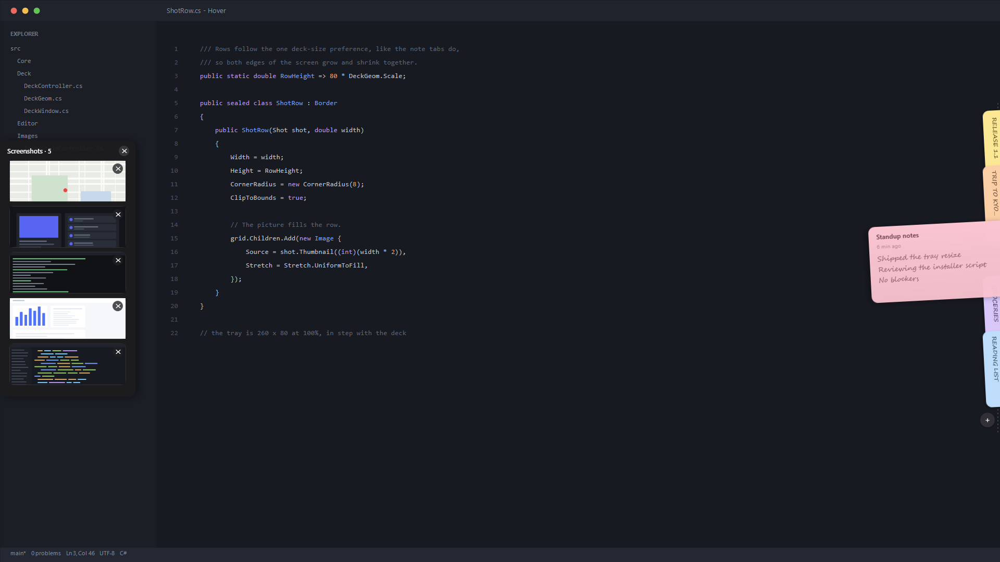

<p align="center">
  
</p>

<h1 align="center">Hover</h1>

<p align="center">Sticky notes and screenshots that live at the edge of your screen.</p>

<p align="center">
  
</p>

Hover keeps two things a hover away: **notes** on the right edge and a **screenshot
tray** on the left. Nothing sits on screen until you need it — move the pointer to
an edge and the panel appears. There is no taskbar window to manage.

Built with .NET 8 and WPF.

## What it does

- **Notes on the right edge.** Hover the right side and your notes fan out as
  tabs. Click one to open it. Plain-text notes with live Markdown styling,
  checkbox tasks, colours, search, pinning and word-based undo.
- **Name a note yourself.** A note's title normally follows its first line. Click
  the title in an open note, or right-click its tab, to name it something else and
  it stays put however you edit the note. Clear the name and it follows the first
  line again.
- **Screenshots on the left edge.** Every snip you take and every image you copy
  lands in a tray on the left. Hover to see them as thumbnails, each with a Delete
  button. Drag one straight onto a website, a chat box, a folder or a terminal.
- **Out of the way.** Both panels are hidden until you hover the edge, so the
  screen stays clean. If you would rather they stayed put, Settings can switch
  auto-hide off for the notes deck and the screenshot tray separately.
- **Autosave and archive**, a searchable All Notes window, drag-to-reorder, and
  multi-monitor support.
- **Import / export** as Markdown, plain text, or a `.stickies` archive.
- **Local and private** — no account, server, analytics or network access.

## Install

Requires Windows 10 or 11.

Download the latest `Hover-Setup-*.exe` from Releases and run it, or build it
yourself (below).

## Shortcuts

Global:

| Shortcut | Action |
|---|---|
| `Ctrl+Alt+N` | New note |
| `Ctrl+Alt+A` | All Notes |
| `Ctrl+Alt+L` | Archive |

Inside a note:

| Shortcut | Action |
|---|---|
| `Esc` | Close the note |
| `Ctrl+F` | Find |
| `Ctrl+T` | Toggle a task |
| `Ctrl+P` | Pin |
| `Ctrl+.` | Cycle colour |
| `Ctrl+Shift+A` | Archive |
| `Ctrl+Shift+Backspace` | Delete, with ten seconds to undo |
| `Ctrl++` / `Ctrl+-` | Change text size |

Shortcuts can be changed in Settings (right-click the tray icon → Settings).

## Privacy

Notes live in `%APPDATA%\Hover`. Note bodies are encrypted with AES-GCM, and the
key is protected with Windows DPAPI.

Screenshots are ordinary picture files in a `Hover Shots` folder under Downloads, so
you can drag one straight into another app. Pick a different folder in Settings if
you'd rather. They are not encrypted — a file you can drop onto any program cannot
also be locked.

Nothing leaves your machine.

## Build

Requires the .NET 8 SDK or newer.

```powershell
# Build and run
.\build.ps1 release run

# Self-contained Hover.exe in .\publish
.\build.ps1 publish

# Run the tests
dotnet test .\Hover.slnx -c Release

# Windows installer (needs Inno Setup 6 or 7) in .\dist
.\build.ps1 installer
```

See [AGENTS.md](AGENTS.md) for the layout of the code and how to work in it.

## License

MIT. See [LICENSE](LICENSE).
