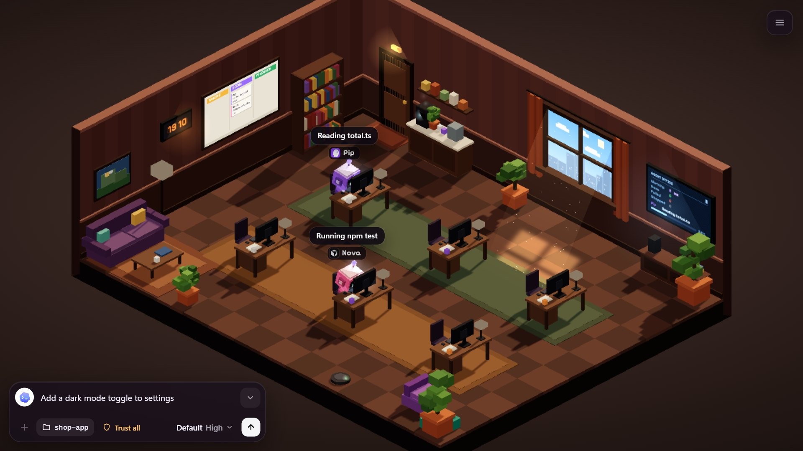
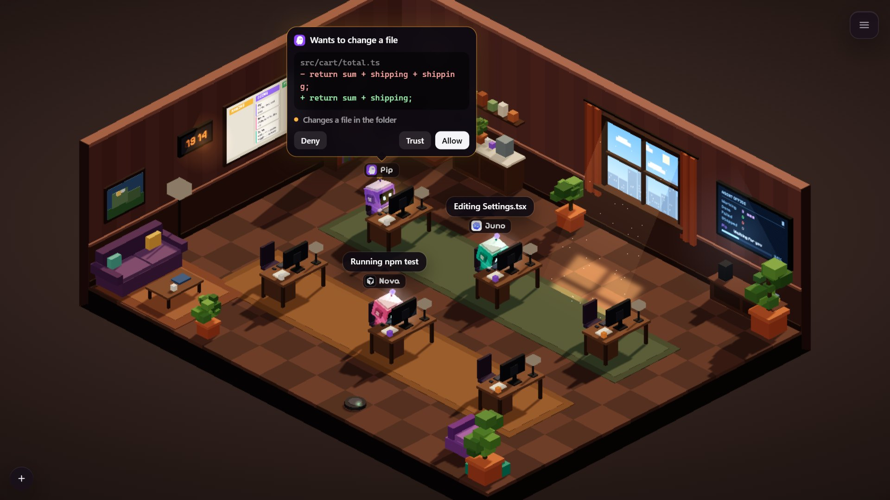
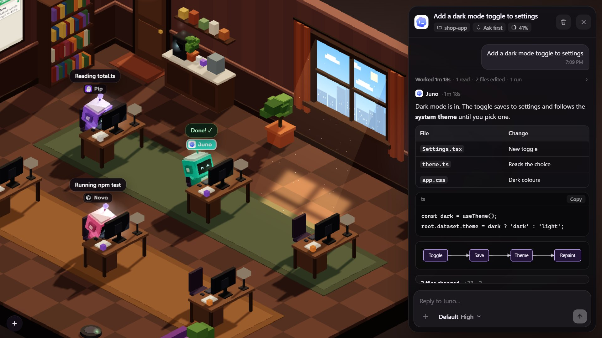
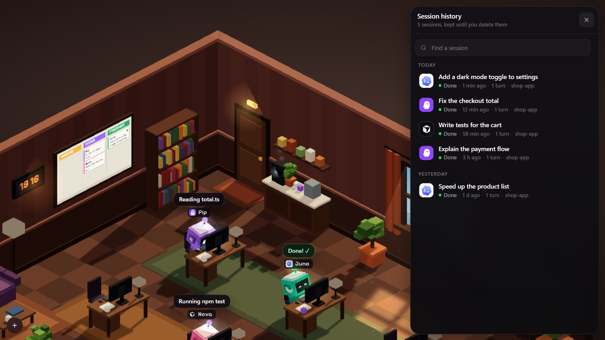

<p align="center">
  
</p>

<h1 align="center">Hover</h1>

<p align="center">
  AI coding agents at work in a notch at the top of your screen.<br>
  Hand a task to Kiro, Codex, Cursor or OpenCode by typing or speaking, and watch it get done.
</p>

<p align="center">
  <a href="https://github.com/4regab/Hover/actions/workflows/ci.yml"></a>
  <a href="https://github.com/4regab/Hover/releases"></a>
  
  
  <a href="LICENSE"></a>
</p>

<p align="center">
  <a href="#install">Install</a> ·
  <a href="#getting-started">Getting started</a> ·
  <a href="#voice">Voice</a> ·
  <a href="#privacy-and-security">Privacy</a> ·
  <a href="#build-from-source">Build</a> ·
  <a href="CONTRIBUTING.md">Contributing</a>
</p>

https://github.com/user-attachments/assets/8c7b498f-4b31-4d88-8861-74a28c711347

## Overview

Hover is a desktop app for Windows and Linux. It lives in a slim black island at the top
centre of your main display. At rest, the island shows the AI quotas you switched on, the
agents at work, or a question an agent is waiting on. Hover over it, click it or press
`Alt+N` to open the **Agent office**. There, each task is a bot at a desk in a small 3D
office.

The agents run in the background in the folder you choose, up to three at once. Hover
never opens a terminal for them. Every session is kept, encrypted, so you can pick any of
them up later.

## Features

| | |
|---|---|
| **Agent office** | Pick a folder, type a task, and the agent works there in the background. Each session gets a bot at a desk. |
| **Readable answers** | Headings, tables, checklists, images and flowcharts. Code is colour-coded, and diffs have line numbers. Command output shows the real exit code. |
| **Honest activity** | The chat shows only the thinking, subagents and changes the agent actually reports. Nothing is made up. |
| **Ask before acting** | Set a tool or a task to ask first. Approve, trust or deny each request in the notch, over the bot, or in the chat. |
| **Reply, queue, pause** | Replies sent during a run wait their turn. Pause stops the current answer, and the next queued reply starts once the agent confirms. |
| **Voice** | Hold `Ctrl+Alt+Space`, say a task, let go. Speech is turned into text on your computer (Phonon) or by Groq. |
| **Projects** | Register the folders voice may work in, the other names you call them by, and each folder's own tool access. |
| **AI quotas** | Claude Code, Kiro, Codex and Cursor usage on the notch, each as its own logo in a ring. |
| **Themes** | Hover's light or dark, the system's, or any VS Code theme installed on your PC. |

| | |
|:---:|:---:|
|  |  |
| Start a task | Approve a change |
|  |  |
| Read the answer | Pick up a past session |

<sub>Screenshots use sample tasks and answers.</sub>

## Install

Download the latest build from [Releases](https://github.com/4regab/Hover/releases).

| Platform | Package |
|---|---|
| Windows 10/11 (x64) | `Hover-Setup-<version>.exe`. It installs over a 2.x install in place and keeps your data. |
| Ubuntu 22.04+ and Debian-based (x64) | `hover_<version>_amd64.deb` |
| Other Linux (x64) | `hover-<version>-linux-x86_64.tar.gz`, or [build from source](#build-from-source) |

Hover then lives in the tray. Only one copy runs at a time: starting it again opens the
dashboard of the copy that is already running.

### Agents

Hover drives the agents you already have. Install and sign in to at least one:

| Agent | Program Hover runs |
|---|---|
| Kiro | `kiro-cli` |
| Codex | `codex-acp` |
| Cursor | `cursor-agent` |
| OpenCode | `opencode` |

The office shows which agents it found, and how to install or sign in to the rest.

## Getting started

1. Open the office: hover over the notch, click it, or press `Alt+N`.
2. Press the circle at the bottom left, pick an agent, and choose a folder.
3. Choose its tool access: **Full**, **Ask first**, **Ask always** or **Read only**.
4. Type the task and press Enter.

Each agent has its own page in Settings (the office menu → Settings) for its model,
effort and tool access. The effort choice shows once the agent has reported its effort
levels, after its first run.

> [!WARNING]
> With **Full** access an agent can change files and run commands in its folder without
> asking. Use a folder under version control.

## Voice

Hold a shortcut, say a task, let go. Hover shows what it heard, the folder, the agent and
its access, then starts a **new chat** after a three-second countdown. Voice is off until
you switch it on in Settings → Voice.

1. **Add projects** (Settings → Projects). Pick a folder, and add the other names you might
   say for it. Each project has its own tool access; a new one starts at Ask first, never
   Full. When a task names no project, or the name isn't clear, it goes to the default
   workspace: `Hover` in your home folder, made the first time it is needed. You can change
   that folder and its access.
2. **The agent.** Voice uses the default agent (the one last picked in the new-task circle)
   with that agent's own model and settings.
3. **Choose speech recognition** (Settings → Voice):
   - **Local (Phonon)** runs on your computer and understands **English only**. Press
     Download on the Phonon card. Nothing is downloaded before you do.
   - **Cloud (Groq)** sends the recording to Groq with your own key from
     [console.groq.com](https://console.groq.com) and detects the language. Check key
     tests it.

   Hover never switches between the two on its own.
4. **Cleanup (optional).** Gemini, OpenAI or any OpenAI-compatible service, with your key
   and model, fixes punctuation and filler words. If it fails, the original text is used.
5. **Talk.** Hold `Ctrl+Alt+Space` (you can change it), speak, and let go. Edit the task to
   stop the countdown, then press Start. Esc cancels. Settings → Voice → Try it shows what
   would start, without starting anything.

### Local speech requirements

| Platform | Download | On disk | Free space during setup |
|---|---|---|---|
| Windows x64 | 420 MB | 1.5 GB | 1.9 GB |
| Linux x64 | 523 MB | 1.8 GB | 2.3 GB |
| Linux arm64 | 410 MB | about 1.8 GB (not tested yet) | about 2.2 GB |

The model itself is 164 MB. The rest is the private Python and PyTorch runtime that
Phonon's engine needs; Hover keeps it in its own folder and never touches a system Python.
Windows also needs the Microsoft Visual C++ Redistributable (x64); the card says so before
anything is downloaded. Remove deletes the whole install.

## Privacy and security

Everything lives in `%APPDATA%\Hover` on Windows and `~/.local/share/Hover` on Linux.
There is no account, server or analytics.

- **Sessions** are encrypted with AES-GCM under a key protected by Windows DPAPI, or on
  Linux by the Secret Service (else a file only you can read).
- **API keys** (Groq, cleanup) are sealed in `secrets.dat` with that same key, never in
  plain text. If the key isn't available, a key you enter is kept only until Hover quits.
- **Network.** Hover itself goes online only for what you switch on:
  - the Cursor and Claude Code quotas, once every five minutes each;
  - the Phonon download;
  - Groq, in Cloud mode;
  - the cleanup service.

  The Kiro quota runs `kiro-cli /usage` on your PC, and the Codex quota reads Codex's own
  logs.
- **Voice data.** Cloud sends the audio to Groq; Local keeps recognition on your computer.
  Cleanup gets the text, never the audio. The recording is deleted after it is turned into
  text.
- **Agents** run as hidden child processes in the folder you choose, and stop with Hover.
  OpenCode's server listens on 127.0.0.1 only, with a password made for each start. Each
  agent stops after 5 or 15 idle minutes (Settings) and starts again when you reply.

## Platform support

| | Windows 10/11 x64 | Linux x64 (X11) | Linux on Wayland |
|---|---|---|---|
| Notch, office, Settings | ✓ | ✓ | ✓ through XWayland |
| Global shortcuts (`Alt+N`, voice) | ✓ | ✓ | Only while an XWayland window has focus |
| Local speech (Phonon) | ✓ | ✓ (arm64 not tested yet) | ✓ |

## Build from source

Requires Rust 1.89 or newer. On Windows, install the MSVC build tools as well. The
toolchain Hover is tested with is pinned in `rust-toolchain.toml`.

On Ubuntu or Debian, the build needs these packages (the tests also use
`fonts-dejavu-core dbus gnome-keyring python3-gi`):

```sh
sudo apt install build-essential pkg-config libfontconfig1-dev libfreetype-dev \
  libasound2-dev libxkbcommon-dev libxkbcommon-x11-dev
```

```powershell
# Windows
.\build.ps1 release run      # build and run
.\build.ps1 test             # all tests
.\build.ps1 publish          # hoverai.exe in .\publish
.\build.ps1 installer        # Hover-Setup-<version>.exe in .\dist (needs Inno Setup 6 or 7)
```

```sh
# Linux
make                         # release build
make test
sudo make install            # /usr/local (PREFIX=, DESTDIR= as usual); make uninstall
make package                 # .deb and tarball in dist/
```

Developer documentation is in [`docs/development`](docs/development): architecture,
testing, profiling and Windows notes. [`AGENTS.md`](AGENTS.md) summarises how the app
works for people and AI agents changing it.

## Contributing

Issues and pull requests are welcome. Read [CONTRIBUTING.md](CONTRIBUTING.md) first. Every
pull request runs the tests and headless screenshots on Windows and Linux.

## License

[MIT](LICENSE)
