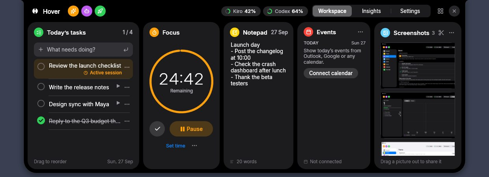
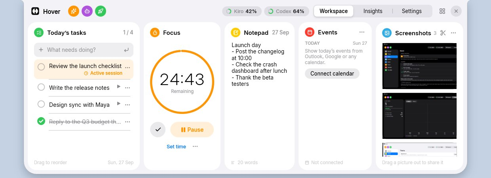
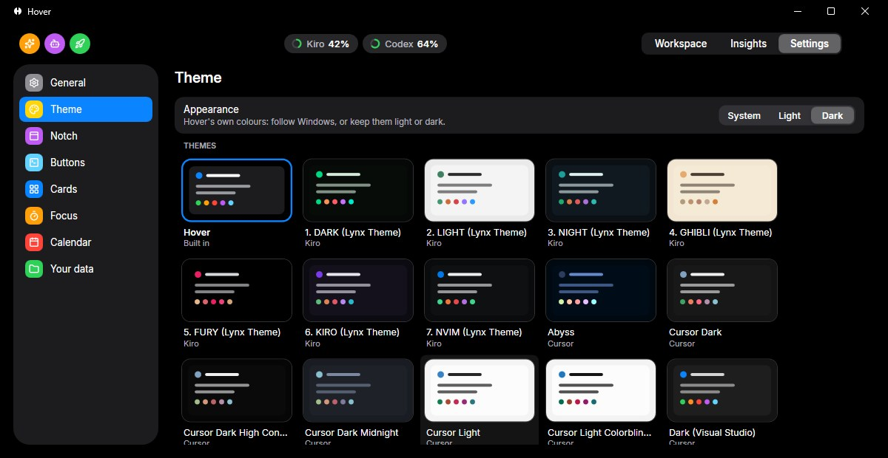

<p align="center">
  
</p>

<h1 align="center">Hover</h1>

<p align="center">Your day in a notch at the top of the screen.</p>

<p align="center">
  
</p>

Rest the pointer at the **top centre** of your main screen, or press `Alt+N`, and the
notch opens into your workspace. At rest it is a slim pill with a running timer and
your AI quotas, or nothing at all. Built with .NET 8 and WPF, for Windows 10 and 11.





## Features

- **Tasks**: add with Enter, drag to reorder, give them time limits and reminders.
- **Focus timer**: a countdown or stopwatch that keeps running in the notch.
- **Notepad**: one note a day; `Ctrl+Enter` turns a line into a task.
- **Events**: today's events from any iCal (`.ics`) calendar.
- **Screenshots**: every snip and copied image, ready to drag into any app.
- **Insights**: seven days of finished tasks and focus time.
- **AI quotas**: Claude Code, Kiro, Codex and Cursor usage, in the header or on the notch.
- **Command buttons**: one click opens a terminal that runs `claude`, `kiro-cli` or any command.
- **Themes**: Hover light or dark, or any VS Code theme on your PC.
- **Your layout**: show, hide, resize and reorder cards, and pick the workspace size.



## Install

Download the latest `Hover-Setup-*.exe` from Releases and run it, or build it
yourself (below).

## Shortcuts

| Shortcut | Action |
|---|---|
| `Alt+N` | Open or close the workspace (global) |
| `Enter` | Add the task you typed |
| `Ctrl+Enter` | In the notepad, turn the caret's line into a task |
| `Esc` | Close the workspace |

`Alt+N` also means Insert in Office and File name in file dialogs, so change it in
Settings → General if you use those.

## Privacy

Everything lives in `%APPDATA%\Hover`. Tasks, the notepad and focus time are kept in
`planner.dat`, encrypted with AES-GCM under a key protected by Windows DPAPI.
Screenshots are ordinary files in `Pictures\Hover Shots`, so they can be dragged
into other apps.

There is no account, server or analytics. Hover only goes online for the calendar
address you add and, if you switch them on, the Cursor and Claude Code quotas (one
request every five minutes each, with the sign-in that tool already keeps). The
Kiro quota runs `kiro-cli /usage` on your PC; the Codex quota reads Codex's own logs.

## Build

Requires the .NET 8 SDK or newer.

```powershell
# Build and run
.\build.ps1 release run

# Self-contained Hover.exe in .\publish
.\build.ps1 publish

# Run the tests
dotnet test .\Hover.slnx -c Release

# Windows installer (needs Inno Setup 6 or 7) in .\dist
.\build.ps1 installer
```

See [AGENTS.md](AGENTS.md) for the layout of the code and how to work in it.

## License

MIT. See [LICENSE](LICENSE). Hover includes the Inter font and Lucide icons; their
licences are in [THIRD-PARTY-NOTICES.txt](THIRD-PARTY-NOTICES.txt).
