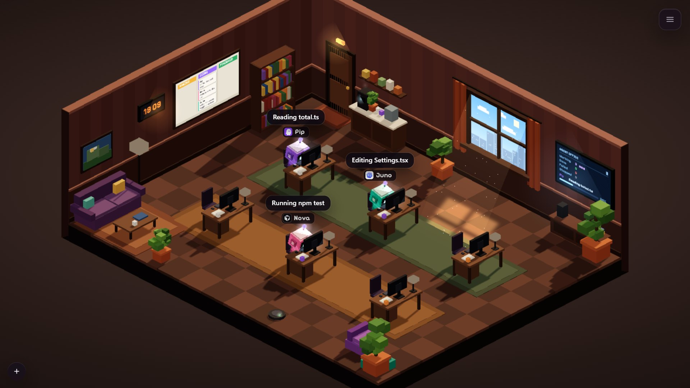

<p align="center">
  
</p>

<h1 align="center">Hover</h1>

<p align="center">AI agents at work in a notch at the top of the screen.</p>

<p align="center"> Monitor and send tasks to your AI agents in a single hover. 
Hover your cursor at the top centre of your screen to expand the notch into your Agent Office. At rest, it sits as a slim island quietly displaying your AI quotas and active agents..</p>

<p align="center">
 

<p align="center">


<p align="center">
  
</p>

## Features

- **Agent office**: pick a project folder, type a task, and Kiro, Codex or Cursor does it there in the background. Run up to three at once; each gets a bot at a desk in a little 3D office that shows how it's going. Answers show as formatted text with tables, code, images and flowcharts; every session is kept (encrypted) on the office's bookshelf, and a reply picks it back up.
- **One button to start**: the circle at the bottom left shows each agent's logo; pick one and type.
- **Ask before acting**: set an agent to ask first, and the notch shows what it wants to run or change. Run, Trust or Deny it right there, or over the agent's head in the office.
- **AI quotas**: Claude Code, Kiro, Codex and Cursor usage on the notch, each as its own logo in a ring.
- **Settings in the office**: the gear opens it; each agent has its own page for model, effort and tool access.
- **Themes**: Hover light or dark, or any VS Code theme on your PC.

| | |
|:---:|:---:|
|  |  |
| Start a task | Approve a change |
|  |  |
| Read the answer | Pick up a past session |

<sub>Screenshots use sample tasks and answers.</sub>

## Install

Download the latest `Hover-Setup-*.exe` from Releases and run it, or build it
yourself (below).

## Privacy

Everything lives in `%APPDATA%\Hover`. The agents' sessions are kept in `agents\`,
encrypted with AES-GCM under a key protected by Windows DPAPI.

There is no account, server or analytics. Hover itself only goes online for the
Cursor and Claude Code quotas, if you switch them on (one
request every five minutes each, with the sign-in that tool already keeps). The
Kiro quota runs `kiro-cli /usage` on your PC; the Codex quota reads Codex's own logs.

The Agent office runs Kiro (`kiro-cli acp`), Codex (`codex-acp`) or Cursor
(`cursor-agent acp`) in the folder you choose. With full tool access they can edit
files and run commands there without asking, so choose a folder under version
control, or set them to ask first (Settings → the agent → Tool access). Hover explains this the first time you open the page. Each tool stays
running for 5 or 15 idle minutes (Settings), then stops until you reply.

## Build

Requires the .NET 10 SDK or newer.

```powershell
# Build and run
.\build.ps1 release run

# Self-contained Hover.exe in .\publish
.\build.ps1 publish

# Run the tests
dotnet test .\Hover.slnx -c Release

# Windows installer (needs Inno Setup 6 or 7) in .\dist
.\build.ps1 installer
```

To publish a release, push a version tag such as `v2.0.1`. The CodeBuild GitHub
workflow builds and tests the app on an AWS Windows runner, makes
`Hover-Setup-2.0.1.exe`, and attaches it to a new GitHub release. Tags must use
three or four numeric version parts. The runner is the `hover-release` CodeBuild
project, defined in `infra/codebuild-runner.yml`. It needs a GitHub connection
in AWS. This uses AWS build time instead of GitHub-hosted runner minutes.

## License

MIT. See [LICENSE](LICENSE). 
