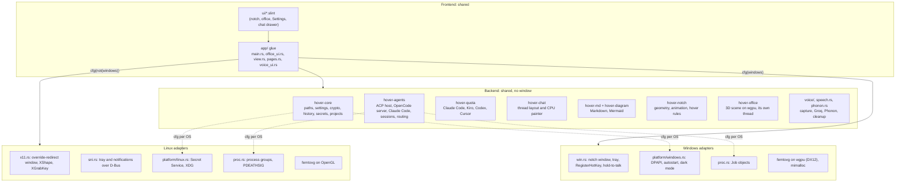
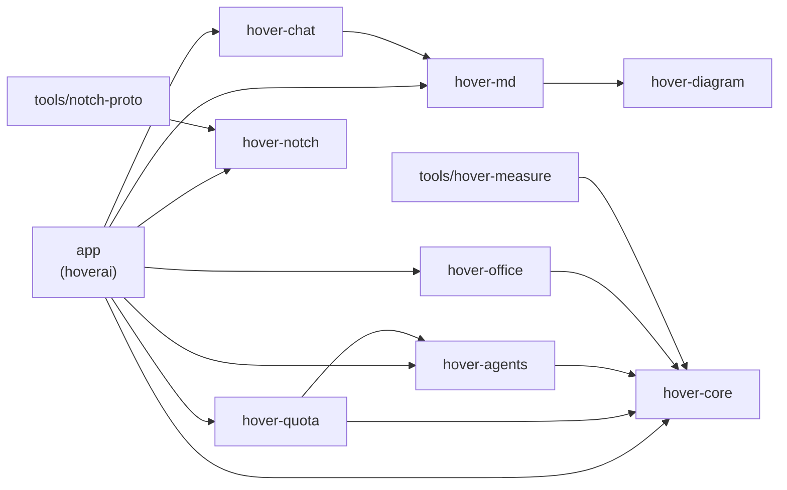
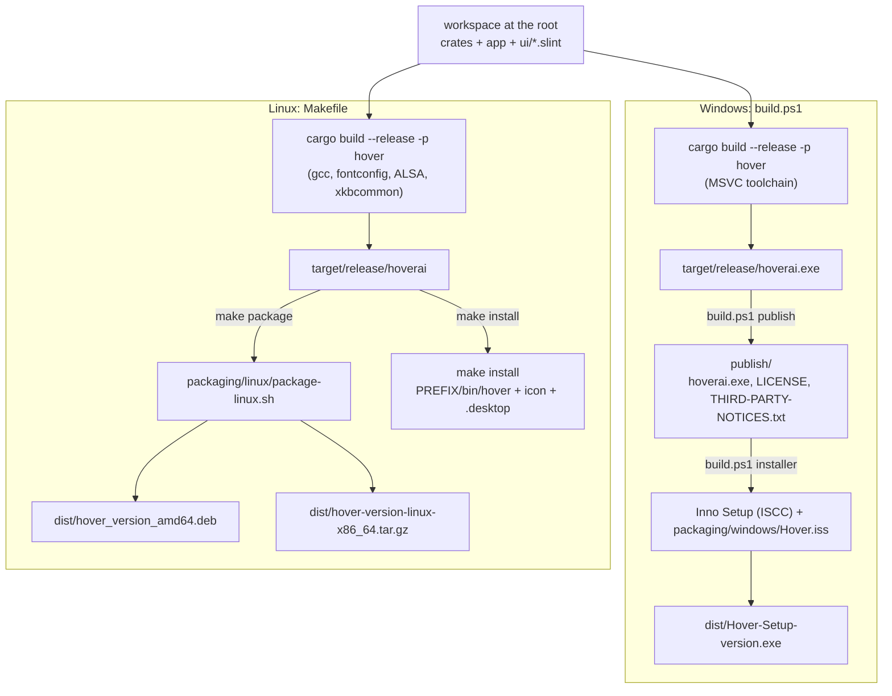
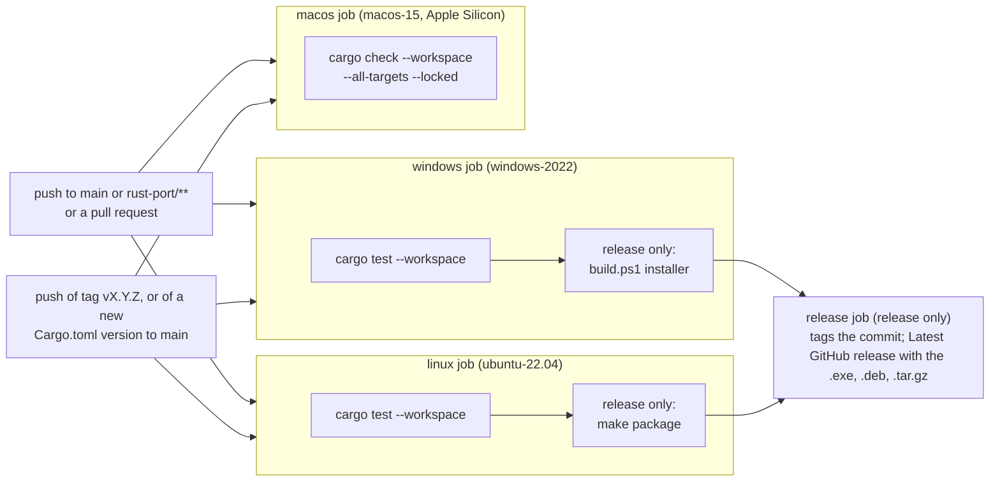

# Architecture

Hover is one Rust workspace at the repository root. One binary (`hoverai`, installed as `hover`
on Linux) holds the whole product. The crates keep the parts that have no window apart
from the parts that do, so most of the logic builds and tests anywhere.

## The big picture

The same code builds for Windows and Linux. Nearly all of it is shared: the backend
crates have no window and no OS calls of their own, and the UI is one set of Slint
files. What differs per OS is a thin layer of adapters, picked at compile time with
`cfg(windows)` / `cfg(not(windows))`.

The Slint files are compiled into Rust at build time (`app/build.rs` runs
`slint_build::compile("ui/app.slint")`), so there is no UI file to ship and no
interpreter at run time. The same markup draws on both OSes; only the renderer under it
differs (see [Frames](#the-offices-frames-and-their-lifetime)).

## How the crates depend on each other

Arrows point at what a crate uses. Nothing in `crates/` depends on `app/`, and no
backend crate depends on Slint.

`hover-core` is the floor: everything that stores or reads the user's data goes
through it. `hover-diagram` and `hover-notch` depend on nothing in the workspace.

## How the builds work

Both platforms run the same Cargo build of the same workspace. They differ in the
wrapper script and in how the result is packaged.

- The binary carries its fonts, icons, music and the Phonon locks and check sample
  (`include_bytes!` / `include_str!`), so the installers ship one executable plus the
  licence files.
- The version is `Cargo.toml`'s `[workspace.package] version`. `build.ps1`,
  the Makefile, the installers and `hoverai --version` all read it from there.
- The Rust toolchain is pinned in `rust-toolchain.toml` at the repo root.

### CI and releases

`.github/workflows/ci.yml` runs on GitHub's own runners. One job per OS does the whole
check, and on a `v*` tag the same job builds the installers from the build it just
tested. A third job compiles the workspace on macOS and does nothing else.

A tag whose version doesn't match `Cargo.toml` fails before anything builds. A
failing test on either OS means nothing is published. The macOS job doesn't gate the
release: it has no package to wait for, and it runs no tests (nothing has been run on a
Mac yet; see `docs/MACOS.md`). It does fail a pull request whose Mac code doesn't compile.
Pushes that only touch Markdown,
`docs/` or the README's pictures don't run CI.

## What runs at run time

One process. The UI thread owns every window; the heavy work runs on threads of its own
and reaches the UI only through `ui_do`. The agents are child processes.

The child processes sit in a Windows job object or a Linux process group, so they stop
when Hover does.

## Crates

| Crate | What it owns | Window? |
|---|---|---|
| `crates/hover-core` | The data folder (`paths.rs`, the old `Noty` move), `settings.json` (`settings.rs`, the exact bytes 2.x wrote), the key and encryption (`crypto.rs`: AES-GCM, key kept by DPAPI or the Secret Service), the sealed session history (`history.rs`), API keys sealed in `secrets.dat` (`secrets.rs`), projects, the default workspace and the voice settings (`projects.rs`), images, the single-instance lock (`single.rs`), colours and VS Code themes (`palette.rs`), and the OS adapters (`platform/windows.rs`, `platform/linux.rs`). | No |
| `crates/hover-agents` | Running the agents: the ACP host (`acp.rs`, JSON-RPC over stdio for Kiro, Codex and Cursor), OpenCode's local server (`opencode.rs` over `http.rs`), Claude Code in its Agent SDK mode (`claude.rs`), the `Runtime` they sit behind (`runtime.rs`), the sessions and their limits (`session.rs`), permission questions (`ask.rs`), voice's project routing (`route.rs`), the office's state message (`state.rs`), process groups and Windows jobs (`proc.rs`). | No |
| `crates/hover-quota` | The four quota readers (Claude Code, Kiro, Codex, Cursor) and their five-minute schedule. | No |
| `crates/hover-md`, `crates/hover-diagram` | Markdown and Mermaid flowcharts, the same output as 2.x's `md.js` and `diagram.js`. | No |
| `crates/hover-chat` | The chat thread: layout per message (cached), selection, copy, images, and a CPU painter. | No |
| `crates/hover-notch` | The notch's geometry, animation and hover rules. | No |
| `crates/hover-office` | The office: scene, bots, wall canvases, camera, picking and pacing (`office.rs`, `scene.rs`, `bot.rs`), the wgpu renderer (`render.rs`, `office.wgsl`), the page's background and vignette (`page.rs`), and its own thread (`live.rs`). | No (renders offscreen) |
| `app` | The product: `main.rs` (windows, renderer, timers), `office_ui.rs` (the office UI around the scene), `view.rs` and `pages.rs` (Settings), `notch.rs` with `win.rs` / `x11.rs` (placing, focus, click-through), tray (`sni.rs` on Linux, `win.rs` on Windows), voice (`speech.rs`, `voice/`, `phonon.rs`, `voice_ui.rs`), `music.rs`, `bench.rs` (the measurement channel), `shots.rs`, `selftest.rs`, and the Slint UI in `ui/*.slint`. | Yes |
| `tools/notch-proto` | The port's Windows notch prototype. Not shipped; kept for `notch-proto --selftest`, the only notch self-test on Windows (the app's `--selftest` is X11 only). | Yes |
| `tools/hover-measure` | Dev tools, not shipped: the external memory sampler, the scenario runner, the summary, `fake-agent`, `fake-opencode` and `fake-anthropic` (a stand-in Anthropic API for the real Claude Code). See [profiling.md](profiling.md). | No |

## Boundaries

- **UI thread.** Slint's event loop runs everything in `app`. Other threads
  reach it only through `ui_do` (`main.rs`), which posts a closure to the loop.
- **Runtime.** `hover_app::app::Hover` (`app.rs`) is the shared state: settings,
  history, one `Runtime` per tool, the sessions, the quota poller. It has no UI; views
  register hooks (`on_sessions`, `on_quotas`, `on_notify`) that fire off the UI thread.
- **Sessions.** `KiroSessions` keeps every session behind one lock. Each turn runs on
  its own thread. `changed` and `ended` fire with the lock released. At most three
  turns run at once (`MAX_RUNNING`); six sessions keep desks (`MAX_KEPT`).
- **Storage.** `AgentHistory` writes the index and one sealed file per session off the
  UI thread, in order. `Hover::shutdown` flushes the history and settings on quit.
- **Views.** The notch and the dashboard window each have their own Slint globals.
  `office_ui.rs` and `view.rs` push the same state into both (`each!`, `publish!`,
  `show_page!`).

## An agent task, end to end

1. The new-task box (`office.slint`) calls `Office.new-go-clicked`.
2. `office_ui.rs` calls `KiroSessions::start_as` with the tool, folder, prompt, images
   and the access picked.
3. `session.rs` gives the session a desk, saves it, and starts a turn thread that calls
   the tool's `RunTask`.
4. For Kiro, Codex and Cursor the runner is `AcpHost::run_as` (`acp.rs`): it starts
   the tool once (`kiro-cli acp …`, `codex-acp`, `cursor-agent acp`), sends
   `session/new` or `session/load`, sets model, effort and access, then
   `session/prompt`. For OpenCode it is `opencode.rs`: one `opencode serve` on
   127.0.0.1 with a password made for that start, `prompt_async`, and its event stream.
   For Claude Code it is `claude.rs`: a `claude` process per conversation, started in
   its folder in the Agent SDK's stream-json mode, `initialize`, then the prompt as a
   user message on its stdin.
5. Updates (`session/update`, OpenCode events, Claude Code's messages) become `KiroEvent`s and phases. The
   session changes, `changed` fires, and the UI marks the office dirty.
6. A permission request (`session/request_permission`) is answered off the read loop:
   `ask.rs` decides what the access setting allows. The rest goes to
   `KiroSessions::ask`, which shows it in the notch, over the bot and in the chat until
   the user answers or the run stops.
7. The turn ends: the result is saved, `ended` fires, and the notch shows the end (and
   a system notification when no office is in view).

## Projects and the default workspace

`hover-core/src/projects.rs`, kept in `settings.json` beside the 2.x keys (`Projects`,
`DefaultWorkspace`, `Voice`; 2.x ignores keys it doesn't know). A project has a stable id,
a name, a folder, aliases, a voice switch and its own access (`full`, `risky`, `always`,
`read`). A new project or workspace starts at `risky` (Ask first): being registered
never grants Full. `resolve_folder` checks a folder before use (absolute, followed links,
readable; Windows' `\\?\` prefix dropped), and `same_folder` keeps one registration per
real folder. The default workspace is home + `Hover` (`C:\Users\<name>\Hover`,
`~/Hover`) unless the user picks another. It is made when a task first needs it
(`ensure_folder`; no git init). Settings → Projects edits all of this (`pages.rs`,
`view.rs`). Removing a project deletes no files, history or runs.

## Keys (`secrets.dat`)

`hover-core/src/secrets.rs`. The Groq key (`voice.groq`) and the cleanup keys
(`cleanup.gemini`, `cleanup.openai`, `cleanup.custom`) are sealed with Hover's own key
(`note.key`, kept by DPAPI or the Secret Service) in `secrets.dat` beside
`settings.json`, written to a temp file and renamed. Settings holds no keys. When Hover's
key isn't there this run, a key is kept in memory until Hover quits (`Stored::ThisRunOnly`)
and Settings says so. It is never written in the clear. Errors never contain a key.

## Voice

Hold the shortcut (Ctrl+Alt+Space at first), speak, let go. The recording becomes
text, is cleaned up if that is on, is routed to a project or the default workspace,
and shows in the notch as a preview. After three seconds it starts a new chat. Voice is
off until switched on in Settings → Voice. Only new tasks start by voice.

- **Capture** (`voice/audio.rs`). cpal opens the chosen microphone or the system's
  default. The audio is mixed to mono and brought to 16 kHz 16-bit as it comes, into one
  buffer that stops at ten minutes (9.6 M samples, 19.2 MB). The notch's level is the
  real RMS. The stream is dropped as soon as the key comes up, the cap is reached, the
  device fails or the user cancels. A recording with no 30 ms window above −50 dBFS, or
  under a quarter second, is "Nothing was heard" (`audible`), with Retry.
- **One file** (`voice/wav.rs`). Just before transcription the samples are written as one
  WAV in the system temp folder's `hover-voice`. It is deleted when dropped, on every
  path. Files a crash left are swept when Hover starts.
- **Speech** (`speech.rs`). One trait for both modes: `Speech::transcribe(wav, cancel)`
  returns a `Transcript` or a `SpeechError`. It blocks, on voice's worker thread. The
  mode (`VoiceSettings.speech`) is read once, at the press. Hover never switches modes on
  its own and never uploads a local recording: Local not Ready is an error that says to
  set it up. A transcript the engine says it cut short is shown for review, never
  counted down.
  - Cloud (`voice/groq.rs`): the WAV to Groq's OpenAI-compatible
    `/audio/transcriptions` with the user's key and model (`whisper-large-v3-turbo` or
    `whisper-large-v3`). No language is sent, so Groq detects it. Over 25 MB is refused
    before upload. The key goes only in the Authorization header and is scrubbed from
    errors. `HOVER_GROQ_BASE` points it at a fake Groq for measuring; only a
    `http://127.0.0.1:PORT` address is taken.
  - Local (`phonon.rs`): below.
- **Cleanup** (`voice/cleanup.rs`), optional and separate from the speech mode. The
  transcript (never the audio) goes to the user's OpenAI-compatible service: the Gemini
  or OpenAI preset, or a custom base URL, with the user's key and model. The instruction
  is fixed and the transcript is the user message. Any failure keeps the original and
  the preview says "Cleanup failed; using the original.": no key or model, the 15 s
  timeout, an error, an empty answer, an answer that lost a negation or changed length a
  lot (`suspect`). A transcript over 12,000 characters isn't sent (it is never cut);
  the note then says it was too long.
- **Routing** (`hover-agents/src/route.rs`). Only voice-enabled projects are candidates.
  `decide` goes by the words first. A name or alias said in full settles it. Among
  several, the active project wins (the chat open in the office, or the new-task box's
  folder, at the press). No project's words at all means the default workspace. Only
  what the words leave open goes to the default agent, in a turn with access `"none"`:
  `AcpHost` and `OpenCodeHost` turn down every request it makes, reads too. It runs in
  an empty temp folder of its own, with a 60 s limit, and gets no desk or chat. Its
  answer is checked (`read_answer`): a project only from the candidates, and its task
  only when it took words off one end and dropped no negation (`task_ok`). The app, not
  the model, turns the pick into a folder, agent, model and access. An agent that
  doesn't answer is an error with Retry, not a default-workspace pick.
- **Preview and dispatch.** The card shows what was heard, the task (editable), the
  folder, the agent and model, the access, and a note (`Routed::note`, for example
  "Using default workspace: no clear project match."). The countdown is 3 s on a
  monotonic clock. Every interaction has an id; Cancel moves it on, so late results are
  dropped. The countdown's end, Start and Enter all go through one locked
  `begin_start`, so exactly one of them dispatches. An edit stops the countdown for
  good; the text is routed again once typing pauses (300 ms), and Start is needed. Start
  checks the target again: still registered and voice-enabled, folder usable, access
  unchanged (the default workspace is made here). A change shows the updated card for
  another Start. Then `voice_ui::start` calls `KiroSessions::start_as(tool, folder,
  prompt, [], Some(access))`: a new chat every time, even beside another chat in the same
  folder. Started shows only once the tool named the conversation, or the turn ended
  well. A failure keeps the prompt; Retry goes back to the card and nothing is resent on
  its own. Read only on a tool with no read only mode here (Codex on Windows) is refused.
- **The agent.** Always the global default: `settings.agent_tool()`, the tool picked
  in the new-task circle, with its `agent_options` (model and the rest). Project
  settings don't change it. When it isn't available (`agents::check`), the card asks for
  another for this task only (`ChooseAgent`), and routing and the run both use that pick.
- **Try it** (Settings → Voice) is `press(true)`: the same mode, cleanup and routing (by
  the words alone when no agent is available), and a preview with Start off. It starts
  no session and makes no folder.

### The voice lifecycle

`Voice` (`voice/mod.rs`) owns the state, behind one mutex, outside the renderer. Its
work runs on threads of its own (`voice`, `voice-route`, `voice-edit`,
`voice-countdown`, `voice-start`). `voice_ui.rs` only draws it (the notch's card, or Try
it's card in Settings) and passes keys and clicks on; changes reach the UI thread one hop
at a time. One interaction runs at a time: a press while one is in progress keeps it and
flashes busy. Escape cancels the voice interaction only; from Starting on, the task is
the chat's. Nothing resumes after a restart.

| Stage | Means | Set by |
|---|---|---|
| `Idle` | Nothing in progress | `dismiss`; `retry` after a recording or transcription error |
| `Recording { level, secs }` | The shortcut is held | `press`, then the `voice` thread |
| `Loading` | Local: Phonon starts and transcribes (one call) | `voice` thread |
| `Transcribing` | Cloud: Groq | `voice` thread |
| `Cleaning` | The cleanup service | `voice` thread |
| `Resolving` | Routing | `voice` thread, `choose_agent`, `retry` |
| `ChooseAgent(Pending)` | The default agent isn't available | routing, or Start's check |
| `Preview(Preview)` | Counting down; Try it's preview has no countdown | routing |
| `Editing(Preview)` | Stopped for good: an edit, a cut-short transcript, a retry, a changed target | `edit`, routing, `retry`, Start's check |
| `Starting(Preview)` | Being dispatched | `begin_start` (countdown, Start, Enter) |
| `Started { session, folder }` | The tool took it | `voice-start` thread |
| `Cancelled` | Escape or Cancel | `cancel` |
| `Error { message, retry, transcript }` | A stage failed; the transcript is kept when there is one | any worker |

### Local speech (Phonon)

`phonon.rs`. Phonon-2 runs in the official `fermion` CLI (Python and CPU PyTorch), so
Hover keeps a Python of its own for it. A system Python is never used or changed. It is
downloaded only when the user presses Download in Settings → Voice, never for Cloud.

- **Pins.** Model `FermionResearch/Phonon-2` at `9c7fef3584499a88fe8d394427f45851bbb8b446`,
  `fermion-research` 0.2.5, CPython 3.12.14 (python-build-standalone 20260929), and the
  wheels per platform in `assets/phonon/wheels-<triple>.txt` (made by `make-lock.py`, at
  build time only). Every file has a pinned URL, size and SHA-256.
- **Before any download.** Windows x64 or Linux x64/arm64, SSE4.1 on x64, not Windows on
  Arm, the VC++ 2015–2022 runtime on Windows, glibc 2.28 or newer on Linux. A device that
  fails is `Unsupported` with the reason. Setup also needs the peak disk plus 300 MB free.
- **Install states** (`Install`): `NotInstalled`, `Unsupported(why)`, `Downloading { done,
  total }`, `Verifying` (every file hashed again), `Installing` (unpack the runtime, pip
  from the local hash-checked wheels only, fermion's own verifying unpacker for the
  model, the model files checked against their pins), `Ready`, `Cancelled`,
  `Failed(why)`. `Ready` means the new install turned the bundled sample
  (`assets/phonon/check.wav`) into the expected words. A partial download is never
  resumed; a finished one is kept for Retry and hashed again.
- **Where files live.** `<data>/phonon/` (`%APPDATA%\Hover\phonon`,
  `~/.local/share/Hover/phonon`): `downloads/` during setup, `installs/<id>/` (the Python,
  `model/`, `licenses/`, `ready.json`), and `current`, a small file naming the live
  install. Each install is built where it lives and `current` is swapped by an atomic
  rename; folders are never moved (Windows refuses while a virus scanner reads them). So
  a failed or cancelled repair leaves the working install as it was. Folders `current`
  doesn't name are swept at the next setup. `VoiceSettings.local` records the model, its
  version and its folder once Ready.
- **Licences.** `installs/<id>/licenses/` keeps Phonon's `NOTICE`,
  `LICENSE-WEIGHTS-CC-BY-4.0.txt` and `LICENSE-CODE-Apache-2.0.txt`, fetched from the
  model repo at the pinned revision.
- **Each recording** runs `python -I -c <fermion's main> transcribe --json <model> <wav>`
  with structured arguments, offline (`HF_HUB_OFFLINE=1`, `TRANSFORMERS_OFFLINE=1`), in a
  process group or job. No server, nothing at login. It exits when done; Cancel kills it,
  and `shutdown` stops it on exit, when voice is switched off or when Local is left.
  Phonon-2 is English only. Recordings over ten minutes are refused.
- **Remove** is refused while setup runs or a transcription reads the files. It forgets
  the install at once and deletes Hover's own folders on a worker. Local then reads Not
  installed; it never switches to Cloud.

Measured sizes and times are in `evidence/voice-chat/phonon-proto.md`.

## The chat's additions

- **Thoughts.** Reasoning the tool exposes becomes a `KiroStep` of kind `thought`, its text
  in `output`, in order among the tool calls. ACP's `agent_thought_chunk` and OpenCode's
  `reasoning` part feed it (`stream.rs`, `opencode.rs`). An ACP thought lasts until the
  agent does something else and keeps 256 KB; an OpenCode thought is one reasoning part,
  done when the part ends. Each closes with its measured time and is saved with the
  session. Nothing is made up from the answer.
- **Subagents.** OpenCode's `task` tool becomes a step of kind `agent` (what it was asked,
  its kind, what it found). The chat lists them, four before Show more. ACP tools send no
  child events, so theirs stay ordinary tool steps.
- **Changes and output.** A diff carries `@@ -N +N @@` only when the tool says where it is
  (an ACP call's location line, a new file, OpenCode's own patch). 400 lines of a change or
  of a command's output are kept, and a cut is said. The chat folds them after eight lines.
  An exit code shows only when the tool gave one.
- **Pause, queue and stop.** A reply sent while a turn runs is queued, in order, and each
  has Cancel (`KiroSessions::cancel_queued`). An empty composer during a turn shows Pause
  (`KiroSessions::pause`): the turn is cancelled through the tool, the conversation stays,
  and the next queued reply goes once, after the tool says the turn has ended. A tool that
  doesn't confirm within 8 s is shut down when no other turn uses it. Otherwise the result
  is `unconfirmed`: the chat says it may still be working, and nothing queued is sent. A
  reply never answers a permission request; it is queued behind it. (An OpenCode question
  that takes free text is answered by a reply.)

## What each provider exposes

What Hover reads from each tool. Kiro, Codex and Cursor speak ACP (`acp.rs`, `stream.rs`);
OpenCode is its own server (`opencode.rs`); Claude Code runs in its SDK mode (`claude.rs`).

| | Kiro, Codex, Cursor (ACP) | OpenCode |
|---|---|---|
| Reasoning | `agent_thought_chunk` text as a thought | `reasoning` parts as a thought |
| Child agents | None in ACP: ordinary tool steps | The `task` tool as an `agent` step |
| Cancellation | `session/cancel`; 8 s, then shut down or `unconfirmed` | `POST /session/{id}/abort`, open questions withdrawn; 8 s, then the same |
| Permissions | `session/request_permission`. Kiro: autopilot off to ask. Codex: its mode (`agent-full-access`, `workspace-write` or `read-only`). Cursor: asks unless `--force`; Ask mode for read only | Per-session rules on its server; `once` answers |
| Read only | Kiro, Cursor; Codex on Linux only | Yes: every change asks, and Hover refuses it |
| Usage | Context %: ACP `usage_update` (used / size), Kiro's `_meta.kiro.contextUsage`. Credits per turn: Kiro's `turn_completion` summary | Context %: the last request's tokens over the model's window |
| Diffs | `diff` content (old and new text); line numbers only from the call's location or a new file | Its edit's unified diff, with the file's line numbers |
| Tool output | `rawOutput`, the last 400 lines; exit code when given (`exitCode`, `exit_code`) | The command's output; exit code when given |

Claude Code (`claude.rs`) in the same terms: reasoning is its thinking blocks (streamed
as `thinking_delta`) as a thought; a subagent's `Task` call is an `agent` step, and the
subagent's own messages (`parent_tool_use_id` set) stay out of the answer; cancellation is
the `interrupt` control request, then its process ended after 8 s; permissions are its
`can_use_tool` requests (Full is `bypassPermissions`); read only switches off its edit and
command tools; context % is the last answer's tokens over the model's window (the result's
`modelUsage`); diffs are its `structuredPatch` hunks with their line numbers; tool output is
`tool_use_result.stdout`/`stderr`. Checked against Claude Code 2.1.287 through
`fake-anthropic`; with a real model only by the maintainer, not in CI.

Observed: written down in the code as seen from the real tool. Kiro sends an empty diff
while an edit is pending. Kiro's context and credit payloads are the shapes quoted in
`stream.rs`. Codex may send a warning before its answer. codex-acp 1.13 dropped
`workspace-write`. Codex's read-only mode wrote files on Windows (no sandbox there), so
Hover doesn't offer it there.

Not verified: whether each real tool sends reasoning text, which tools send
`usage_update`, OpenCode's `task` and `reasoning` events, the diff line numbers, and an
unconfirmed stop. These are handled in code and tested against fakes only
(`hover-agents/tests/`, `stream.rs`'s tests). The voice live smoke used `fake-agent`, not
the real tools.

## The office's frames and their lifetime

- The office is made the first time an office is in view (`office_follow`). It runs on
  its own thread (`hover_office::live`). The UI sends it the state (at most every
  120 ms, only when something changed), the pointer and resizes.
- Each frame: the scene is rendered on wgpu, read back, and composed on the CPU over
  the page's background and vignette (`page.rs`). The UI makes a blurred quarter-size
  copy for the glass panels.
- On Windows the office shares the windows' GPU device (`shared_gpu` in `main.rs`). The
  frame goes into one texture that the windows draw directly, written in place each
  frame (`office_ui.rs`, `upload`). On Linux the office has its own device (Vulkan or
  GL), and the frame reaches Slint (femtovg on OpenGL) as a pixel buffer.
- Hidden for 30 s, the office is dropped: its thread, renderer and textures go, and the
  allocator gives the pages back (`office_drop`). Shown again, it is made again at once,
  with the camera and open chat restored.
- Pacing: 30 fps while a bot walks or works, 10 fps idle, 1 fps with animations off,
  nothing while hidden.

## OS adapters

| Concern | Windows | Linux |
|---|---|---|
| Notch window | `win.rs`: borderless, topmost, `WS_EX_NOACTIVATE`; click-through by layered hit mode | `x11.rs`: override-redirect dock window, ARGB visual, XShape input region; Wayland through XWayland |
| Renderer | femtovg on wgpu (DX12, DirectComposition), one shared device | femtovg on OpenGL; office on its own wgpu device |
| Tray, notifications | `win.rs` (Shell_NotifyIcon) | `sni.rs` (StatusNotifierItem over D-Bus) |
| Shortcut | `RegisterHotKey` | `XGrabKey` |
| Voice hold-to-talk | `win::register_hold`: `RegisterHotKey` for the press, `GetAsyncKeyState` every 30 ms for the release | `x11::Grab::register_hold`: KeyPress/KeyRelease, XKB detectable auto-repeat, key state read every 50 ms while held; Wayland through XWayland only |
| Microphone | cpal on WASAPI | cpal on ALSA |
| Key storage | DPAPI | Secret Service, else a file only the user can read |
| Child processes | Job object (tools die with Hover) | Process group with `PR_SET_PDEATHSIG` |
| Single instance | Named mutex `Local\HoverRunningInstance` | Lock file in `$XDG_RUNTIME_DIR` |
| Allocator | mimalloc (freed pages go back to Windows) | glibc malloc, `malloc_trim` after the office drops |

Keep OS code behind `cfg(windows)`, `cfg(target_os = "linux")` or `cfg(target_os = "macos")`
in these files. Check `cfg(not(windows))` branches carefully: they used to mean Linux and
now also reach a Mac. X11, D-Bus, the Secret Service, XDG and ALSA are Linux-only.
What can be worked out without the OS (the Keychain and LaunchAgent logic in `hover-core`,
the sandbox's settings text) is in functions compiled on
every OS, so the Windows tests cover it.

### macOS

The Mac app is not the Slint app (`hover` refuses to compile on a Mac). It is Swift in
`macos/Sources` (notch, menu bar, Settings, voice) around the web office (`web/office/`,
in a WKWebView), and it starts `hover-backend` (`crates/hover-backend`) through
`hover-guardian`, speaking JSON lines on stdin and stdout. `scripts/build-macos.sh` makes
`Hover.app` from the three.

| Concern | macOS |
|---|---|
| Notch window | `Notch.swift`: an `NSPanel` (non-activating) at `.statusBar` level (25) on all Spaces whose `canBecomeKey` is false while the notch rests; the hardware notch comes from `safeAreaInsets` and the auxiliary areas (`NotchGeometry`) |
| Renderer | the office is the web page (three.js) in a WKWebView |
| Usage, tray | one status item in the menu bar with the usage rings and one menu (`MenuBar.swift`); usage isn't in the island |
| Shortcut | Carbon `RegisterEventHotKey`, plus a local key monitor for the windows that hold the keyboard (`Hover.swift`) |
| Voice hold-to-talk | the hot key's press and release |
| Microphone | `AVAudioEngine`, then Apple's speech recognizer (`Voice.swift`); the system asks the first time |
| Key storage | the login Keychain (service `dev.hover.history`), read by the Swift app and handed to the backend at `initialize` |
| Child processes | `guardian.c` stops the backend and what is left when the app's pipe closes; the tools lead a process group each with a watchdog (no `PDEATHSIG`) |
| Single instance | none in the Swift app |
| Dark mode | the menu bar item redraws when its `effectiveAppearance` changes |
| Launch at Login | `SMAppService.mainApp` |
| Agent browser | `AgentBrowser.swift`: a WKWebView per session, driven by `browser.rs`'s calls, relayed by `hover-backend`'s `browser_host.rs` |
| Screen panel | `Screen.swift`: ScreenCaptureKit |
| Allocator | system malloc |

## Where to change things

- **A setting.** Add it to `hover-core/src/settings.rs` (keep the JSON names and
  their order: 2.x reads the same file). Show it in `app/src/pages.rs`, and
  handle its click in `view.rs` (`toggled`, `pressed`, `picked_seg`, `menu_pick`).
- **Something in the office UI.** `ui/office.slint` for the look;
  `office_ui.rs` (`wire_office`, `office_widgets`) for what it shows and does.
- **The 3D office.** `hover-office`: `scene.rs` (the room), `bot.rs`, `office.rs`
  (behaviour), `render.rs` and `office.wgsl` (drawing).
- **A provider.** Add an `AgentTool` variant in `hover-core/src/model.rs`. Then add its
  executable, arguments, install and sign-in hints, and status check in
  `hover-agents/src/agents.rs`, and its capabilities in `runtime.rs`. If it speaks ACP,
  `AcpHost` runs it; map its access modes in `AcpHost::configure` and
  `permission`. Otherwise write a runtime like `opencode.rs` and put it behind
  `Runtime`. Add its logo to `ui/marks.slint`, its colour to `TOOLS` in
  `office_ui.rs`, and a settings page in `pages.rs`. Test it against `fake-agent`
  (`tools/hover-measure`) and a fake host like `tests/acp_host.rs`.
- **A quota.** `hover-quota/src/read.rs` and `lib.rs`; the notch item id in
  `settings.rs`'s notch items.
