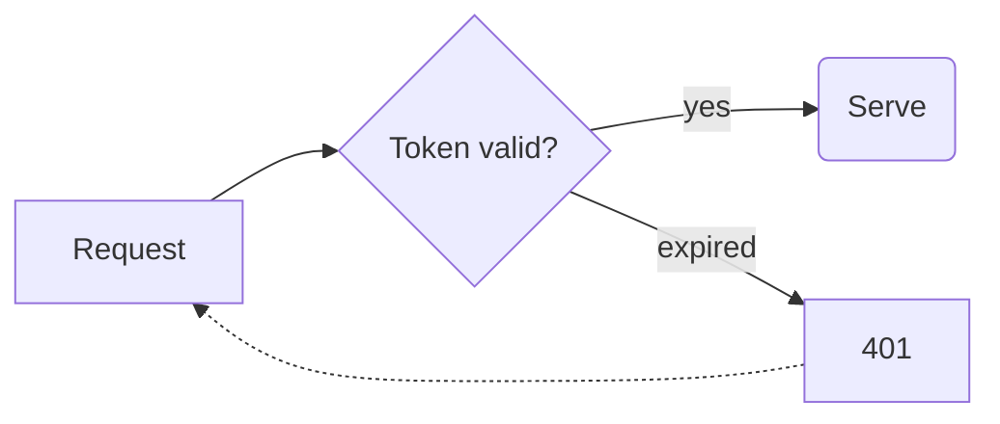

## What changed

I moved the **token check** into `RefreshService` and made refresh tokens expire after _30 days_. Using an expired one now returns `401`, and ~~the old fallback~~ is gone.

See [the RFC](https://datatracker.ietf.org/doc/html/rfc6749#section-6) or https://example.com/docs/auth.

### Files

1. `src/auth/refresh.ts`: the expiry check
2. `src/auth/session.ts`: passes the clock in
   - so tests can move time
   - without sleeping
3. `tests/refresh.test.ts`

- [x] Build is clean
- [ ] Deploy to staging
- [x] All 83 tests pass

> The tokens in production were minted before this change,
> so they get the full 30 days from **today**.

| File | Lines | Status |
|:-----|------:|:------:|
| refresh.ts | +24 −3 | changed |
| session.ts | +6 | changed |
| refresh.test.ts | +61 | new |

```ts
export function expired(t: Token, now = Date.now()): boolean {
  return now - t.issuedAt > 30 * DAY; // 30 days
}
```



---


That's all. Reply "ship it" and I will open the PR.
